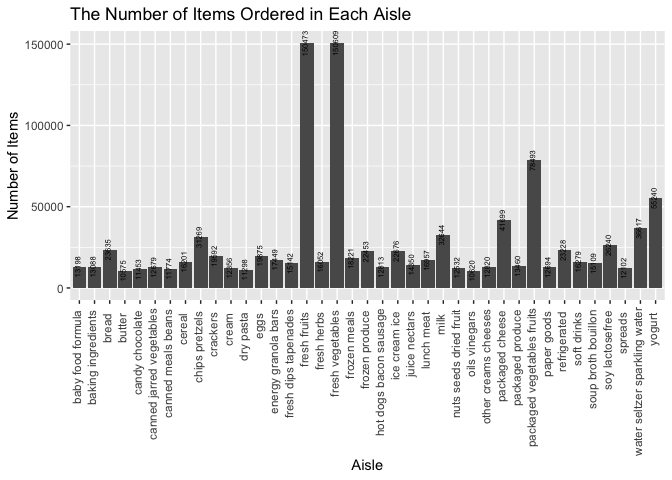

p8105\_hw3\_sl4655
================
Shuya Liu
October 12, 2019

Problem 1
---------

``` r
data("instacart")
instacart <- instacart %>%
  janitor::clean_names()
```

#### A Short Description

The dataset has 1384617 observations of 15 variables: order\_id, product\_id, add\_to\_cart\_order, reordered, user\_id, eval\_set, order\_number, order\_dow, order\_hour\_of\_day, days\_since\_prior\_order, product\_name, aisle\_id, department\_id, aisle, department. The descriptions for the variables are as below:

-   order\_id: order identifier
-   product\_id: product identifier
-   add\_to\_cart\_order: order in which each product was added to cart
-   reordered: 1 if this prodcut has been ordered by this user in the past, 0 otherwise
-   user\_id: customer identifier
-   eval\_set: which evaluation set this order belongs in (Note that the data for use in this class is exclusively from the “train” eval\_set)
-   order\_number: the order sequence number for this user (1=first, n=nth)
-   order\_dow: the day of the week on which the order was placed
-   order\_hour\_of\_day: the hour of the day on which the order was placed
-   days\_since\_prior\_order: days since the last order, capped at 30, NA if order\_number=1
-   product\_name: name of the product
-   aisle\_id: aisle identifier
-   department\_id: department identifier
-   aisle: the name of the aisle
-   department: the name of the department

Take the first line as an example: the user with user ID 112108 placed an order with order ID 1. The first item he/she added to the card is Bulgarian Yogurt with product ID 49302, and this product has been ordered in the past. This is the 4th order of this user, and he/she placed this order on a Thursday at 10 a.m. It has been 9 days since his/her last order. The Bulgarian Yogurt is on the "yogurt" aisle with ID 120, in the department of dairy eggs with deparment ID 16.

#### How many aisles are there, and which aisles are the most items ordered from?

``` r
# Number of aisles
n_aisles <- 
  instacart %>% 
  distinct(aisle_id) %>% 
  nrow()
```

-   There are 134 aisles.

-   The top 6 aisles that the most items are ordered from are

``` r
# Count number of items sold on each aisle and arrange them in a descending order
instacart %>% 
  group_by(aisle) %>% 
  summarise(number_of_items = n()) %>%
  arrange(desc(number_of_items)) %>% 
  head() %>% 
  knitr::kable()
```

| aisle                         |  number\_of\_items|
|:------------------------------|------------------:|
| fresh vegetables              |             150609|
| fresh fruits                  |             150473|
| packaged vegetables fruits    |              78493|
| yogurt                        |              55240|
| packaged cheese               |              41699|
| water seltzer sparkling water |              36617|

#### Make a plot that shows the number of items ordered in each aisle, limiting this to aisles with more than 10000 items ordered. Arrange aisles sensibly, and organize your plot so others can read it.

``` r
instacart %>%
  group_by(aisle) %>%
  summarize(number_of_items = n()) %>%
  filter(number_of_items > 10000) %>%
  arrange(desc(number_of_items)) %>%
  ggplot(aes(x = aisle, y = number_of_items)) +
  geom_col() +
  geom_text(aes(label = number_of_items, angle = 90), size = 2, vjust = 0.2) +
  labs(
    title = "The Number of Items Ordered in Each Aisle",
    x = "Aisle",
    y = "Number of Items"
  ) +
  theme(axis.text.x = element_text(angle = 90, hjust = 0.95, vjust = 0.2))
```



#### Make a table showing the three most popular items in each of the aisles “baking ingredients”, “dog food care”, and “packaged vegetables fruits”. Include the number of times each item is ordered in your table.

``` r
instacart %>%
  filter(aisle == c('baking ingredients', 'dog food care', 'packaged vegetables fruits')) %>%
  group_by(aisle, product_name) %>% 
  summarise(num_of_purchase = n()) %>% 
  top_n(3) %>%
  knitr::kable()
```

    ## Selecting by num_of_purchase

| aisle                      | product\_name                                   |  num\_of\_purchase|
|:---------------------------|:------------------------------------------------|------------------:|
| baking ingredients         | Light Brown Sugar                               |                157|
| baking ingredients         | Organic Vanilla Extract                         |                122|
| baking ingredients         | Pure Baking Soda                                |                140|
| dog food care              | Organix Chicken & Brown Rice Recipe             |                 13|
| dog food care              | Organix Grain Free Chicken & Vegetable Dog Food |                 14|
| dog food care              | Original Dry Dog                                |                  9|
| packaged vegetables fruits | Organic Baby Spinach                            |               3324|
| packaged vegetables fruits | Organic Blueberries                             |               1692|
| packaged vegetables fruits | Organic Raspberries                             |               1920|

#### Make a table showing the mean hour of the day at which Pink Lady Apples and Coffee Ice Cream are ordered on each day of the week; format this table for human readers (i.e. produce a 2 x 7 table).

``` r
mean_hour <- instacart %>% 
  filter(product_name == c('Pink Lady Apples', 'Coffee Ice Cream')) %>% 
  select(order_dow, order_hour_of_day, product_name) %>% 
  group_by(product_name, order_dow) %>% 
  summarize(mean_time = mean(order_hour_of_day)) %>% 
  pivot_wider(names_from = product_name, values_from = mean_time) %>% 
  t() %>%
  round(2) %>% 
  as.data.frame()
```

    ## Warning in product_name == c("Pink Lady Apples", "Coffee Ice Cream"):
    ## longer object length is not a multiple of shorter object length

``` r
colnames(mean_hour) <- c('Sunday','Monday','Tuesday','Wednesday','Thursday','Friday','Saturday')
knitr::kable(mean_hour[-1,])
```

|                  |  Sunday|  Monday|  Tuesday|  Wednesday|  Thursday|  Friday|  Saturday|
|------------------|-------:|-------:|--------:|----------:|---------:|-------:|---------:|
| Coffee Ice Cream |   13.22|   15.00|    15.33|      15.40|     15.17|   10.33|     12.35|
| Pink Lady Apples |   12.25|   11.68|    12.00|      13.94|     11.91|   13.87|     11.56|

Problem 2
---------

#### Data Cleaning

-   format the data to use appropriate variable names;
-   focus on the “Overall Health” topic
-   include only responses from “Excellent” to “Poor”
-   organize responses as a factor taking levels ordered from “Poor” to “Excellent”

``` r
data("brfss_smart2010")
df_brfss <- brfss_smart2010 %>% 
  janitor::clean_names() %>% 
  filter(topic == 'Overall Health') %>%
  mutate(response = as.factor(response))
df_brfss$response <-
  factor(df_brfss$response,levels(df_brfss$response)[c(4,2,3,5,1)])
```

#### In 2002, which states were observed at 7 or more locations? What about in 2010?

``` r
year_2002 <- df_brfss %>%
  filter(year == 2002) %>%
  group_by(locationabbr) %>%
  mutate(number_of_obs = length(unique(locationdesc))) %>%
  filter(number_of_obs == 7) %>% 
  distinct(locationabbr)
```

For year 2002, the states that were observed at 7 or more location were CT, FL, NC.

``` r
year_2010 <- df_brfss %>%
  filter(year == 2010) %>%
  group_by(locationabbr) %>%
  mutate(number_of_obs = length(unique(locationdesc))) %>%
  filter(number_of_obs == 7) %>% 
  distinct(locationabbr)
```

For year 2010, the states that were observed at 7 or more location were CO, PA, SC.

#### Construct a dataset that is limited to Excellent responses, and contains, year, state, and a variable that averages the data\_value across locations within a state. Make a “spaghetti” plot of this average value over time within a state

``` r
df_brfss %>%
  filter(response == 'Excellent') %>%
  group_by(year, locationabbr) %>%
  summarise(mean_data_value = mean(data_value)) %>% 
  mutate(state = locationabbr,
         mean_data_value = round(mean_data_value, 2)) %>% 
  select(year, state, mean_data_value) %>%
  ggplot(aes(x = year, y = mean_data_value, color = state)) +
  geom_line()
```

    ## Warning: Removed 3 rows containing missing values (geom_path).


#### Make a two-panel plot showing, for the years 2006, and 2010, distribution of data\_value for responses (“Poor” to “Excellent”) among locations in NY State

``` r
year_2006 <- df_brfss %>%
  filter(year == 2006,
         locationabbr == 'NY') %>%
  ggplot(aes(x = response, y = data_value)) +
  geom_point() +
  ylim(0, 43) +
  labs(
    title = "Distribution of Data Value in NY in 2006",
    x = "Response",
    y = "Data Value"
  ) 

year_2010 <- df_brfss %>%
  filter(year == 2010,
         locationabbr == 'NY') %>%
  ggplot(aes(x = response, y = data_value)) +
  geom_point() +
  ylim(0, 43) +
  labs(
    title = "Distribution of Data Value in NY in 2010",
    x = "Response",
    y = "Data Value"
  ) 

year_2006 + year_2010
```


